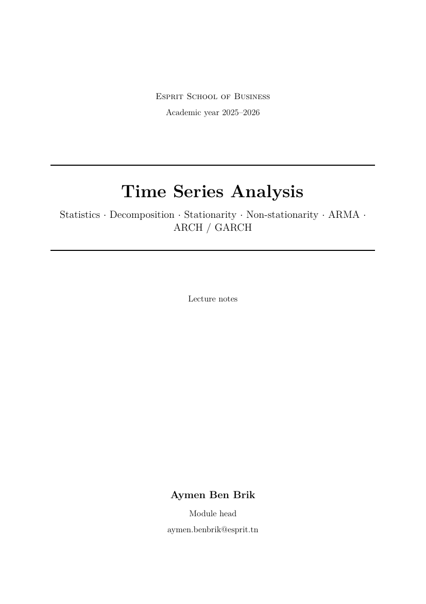
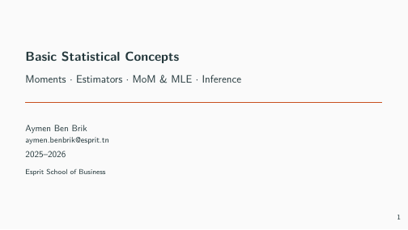
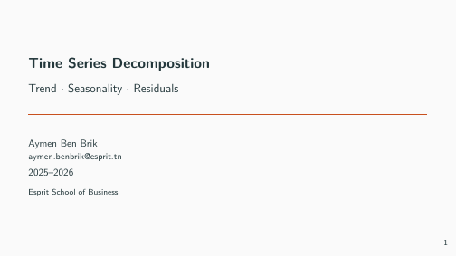
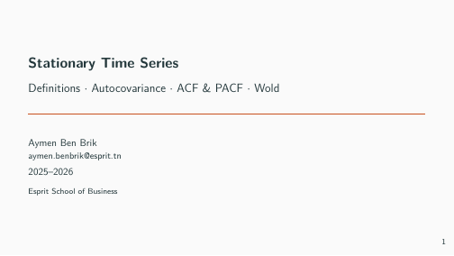
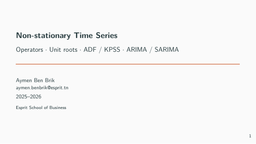
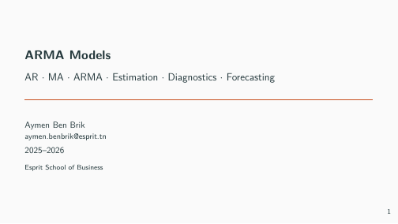
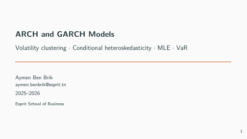
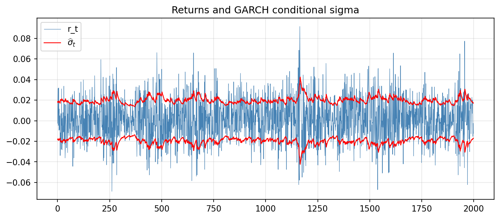
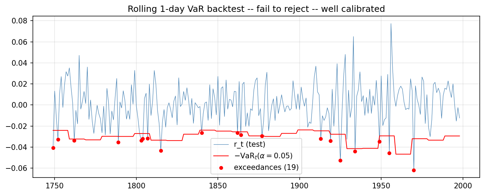

# Time Series Analysis — Esprit School of Business

**Module head:** Aymen Ben Brik
**Email:** aymen.benbrik@esprit.tn
**Institution:** Esprit School of Business
**Academic year:** 2025–2026
**Target:** 1GAMMA (1st-year GAMMA) — to be confirmed

> Course on **Time Series Analysis** — six chapters, from basic
> statistics to ARCH/GARCH volatility models. Lectures and labs
> in **English**, lecture sheet (`Fiche Module`) in **French**.

<p align="center">
  
</p>

---

## Course outline

| # | Chapter | Main sections |
|---|---------|----------------|
| 1 | **Basic statistics** | Moments · estimation (MoM, MLE) · sampling distributions · inference |
| 2 | **Decomposition** | Trend estimation · seasonality estimation · classical decomposition |
| 3 | **Stationary time series** | Strict & weak stationarity · ACF / PACF · Wold · ARMA preliminaries |
| 4 | **Non-stationary time series** | Random walk · unit roots · Dickey–Fuller / KPSS · differencing · ARIMA |
| 5 | **ARMA models** | AR, MA, ARMA · estimation · diagnostics · forecasting |
| 6 | **ARCH and GARCH models** | Conditional heteroskedasticity · ARCH · GARCH · estimation · volatility forecasting |

Each chapter is delivered with:
- a **lecture-notes chapter** (`chapterX/chapitre.tex`),
- a set of **Beamer Metropolis 16:9 slides** (`chapterX/slides.tex`),
- a **lab** (statement + solution + Python/R seed),
- a **mini-project** mobilising the chapter's notions.

A **final assembled lecture book** (`polycopie/polycopie.pdf`),
a **final integrative project** (`projet-final/`), a **reflective
activity** (`activite-reflexive/`) and the **official ECUE sheet**
in French (`Fiche Module/Fiche_TimeSeries.docx`) complete the module.

## Slide previews

| | | |
|---|---|---|
|  |  |  |
| Ch.1 — Basic statistics | Ch.2 — Decomposition | Ch.3 — Stationarity |
|  |  |  |
| Ch.4 — Non-stationarity | Ch.5 — ARMA models | Ch.6 — ARCH / GARCH |

## Final integrative project — highlights

The final project chains every chapter into a single risk-management
study (synthetic daily prices with hidden GARCH$(1,1)$ dynamics):

<p align="center">
  
  
</p>

The right panel shows the rolling 1-day VaR(5%) (red line) on the
last 250 business days of the test set; red dots are realised
exceedances. The reference solution recovers $(\alpha_1, \beta_1) =
(0.073, 0.884)$ for the GARCH (close to the hidden truth) and the
**Kupiec proportion-of-failures test passes** with $LR = 3.09 < 3.84$
(19 exceedances vs. expected 12.5) — i.e., the dynamic VaR is
well-calibrated.

## Repository layout

```
.
├── README.md
├── LIVRABLE.md
├── .gitignore
├── assets/
├── preamble/
│   ├── macros.tex                  (common math + time-series macros)
│   ├── slides-preamble.tex         (Metropolis 16:9, English)
│   ├── poly-preamble.tex           (book class, English)
│   └── td-tp-preamble.tex          (article, English)
├── chapitre1-statistics/
├── chapitre2-decomposition/
├── chapitre3-stationarity/
├── chapitre4-nonstationarity/
├── chapitre5-arma/
├── chapitre6-arch-garch/
├── polycopie/
├── projet-final/
├── activite-reflexive/
├── Fiche Module/                   (official ECUE sheet, in French)
├── _build_test/                    (compile skeletons)
└── _archives/                      (legacy slides, sustainability article, 1BA pptx)
```

## Conventions

- **Slides:** Beamer *Metropolis*, 16:9, title page with
  `Aymen Ben Brik` / `aymen.benbrik@esprit.tn` / `Esprit School of Business`.
- **Lecture notes:** `book` class with `tcolorbox`
  (`defbox`, `thbox`, `propbox`, `exbox`, `rembox`, `infobox`, `warnbox`).
- **Labs:** statement + solution + Python (or R) seed file +
  reproducible reference solution.
- **Reproducibility:** `numpy.random.seed(42)` / `set.seed(42)` in R.

## Compilation

```bash
# Final lecture book (after Step 8)
cd polycopie && pdflatex polycopie.tex && pdflatex polycopie.tex

# Slides for one chapter
cd chapitre1-statistics && pdflatex slides.tex && pdflatex slides.tex
```

> Run **twice** to resolve TOC and cross-references.

## Roadmap (14 numbered steps)

| # | Step | Status |
|---|------|--------|
| 1 | Repo + skeleton + reusable preambles + archive of legacy material | ✅ |
| 2 | Ch.1 — Basic statistics (slides + chapter + Lab1 + Project 1) | ✅ |
| 3 | Ch.2 — Decomposition | ✅ |
| 4 | Ch.3 — Stationarity | ✅ |
| 5 | Ch.4 — Non-stationarity | ✅ |
| 6 | Ch.5 — ARMA models | ✅ |
| 7 | Ch.6 — ARCH / GARCH | ✅ |
| 8 | Final assembled lecture book | ✅ |
| 9 | Final integrative project | ✅ |
| 10 | Reflective activity | ✅ |
| 11 | ECUE sheet (French) + LIVRABLE.md (AA / AAP) | ✅ |
| 12 | Final compile + README screenshots | ✅ |
| 13 | v1.0.0 release tag + memory file | ✅ |
| 14 | Push to GitHub `Aymenbenbrik/TimeSeries2026` | ⏳ |
